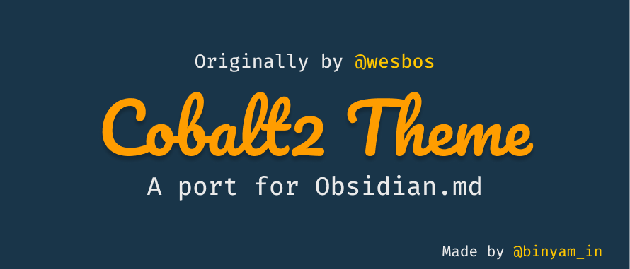

# Cobalt2 Obsidian
A (WIP) port of the cobalt2 theme (by [@wesbos](https://github.com/wesbos)) for [Obsidian.md](https://obsidian.md)

<!-- ## Official Colors
Yellow: #ffc600\
Orange: #FF9D00\
Mint: #2AFFDF\
Blue: #193549\
Off Blue: #0D3A58 (use on variable bgs)\
Dusty Blue: #35434d\
Dark Blue: #15232D\
Pink: #FB94FF\
Light Blue: #9EFFFF\ -->